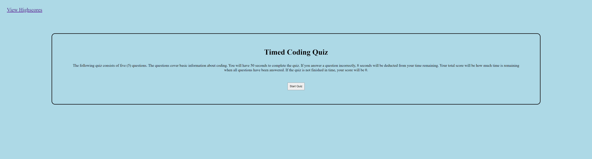

# Coding Quiz
A quiz for people who want to test their knowledge on the basics of coding.

## Project Description
This application consists of a HTML, CSS, and JavaScript file. When the user loads the page they are presented with a landing page. The landing page displays the instructions of the quiz, how the quiz will be scored and a Start Quiz button. When the user selects the Start Quiz button the first quiz question is displayed to the screen and a timer of 60 seconds begins. The application is mainly run through the JavaScript file. Below are some of the functions set in the JavaScript file to make the quiz functional:

* A timer interval was set that will be started when the "Start Quiz" button is selected by the user. The timer will count down by one second for a total of 50 seconds.
* The questions, answer options and correct answer are set in an object so that the questions and answer options can be dynamically created through the JavaScript file. 
    * The function to display the next question is ran when the user selects the Next button as well as shows the previous question when the user selects the Previous button.
* When the timer is complete an alert message is displayed stating "Time's Up!".

## Future Improvements
Due to some time restrictions the entire Acceptance Criteria was not programmed into the application. Below are functions that are planned to be included in a later edition of the application.
* Compare the users selection of an answer with the correct answer set in the object within the JavaScript file.
* Set function to deduct total time of quiz by 8 seconds if the user gets the answer incorrect.
    * When the user answers a question an alert message will display if they answered correctly or wrong.
* When time is up or user answered all the questions, end the quiz and display the users score.
    * Users score will be the time remaining in the quiz.
* Display an input field for the user to place their initials and save their score.
* Score will get saved in the local storage and available to see later.
* Lastly the user will have the choice to clear the highscores and to retake the quiz.

## Snapshot of Deployed site
* Below are snapshots of the quiz landing page, example question with timer running and question with time up.

## Project URLs